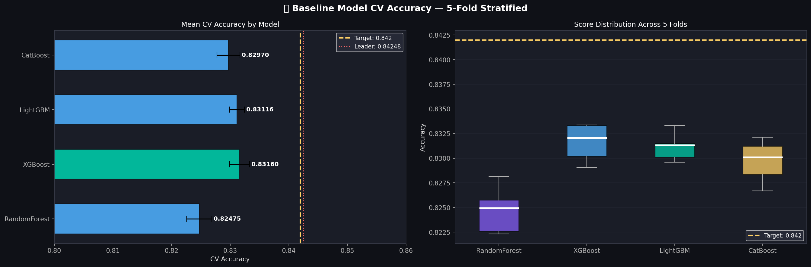
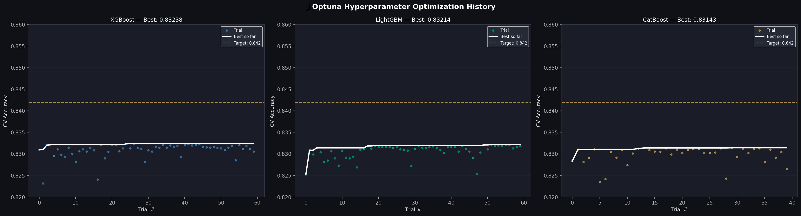
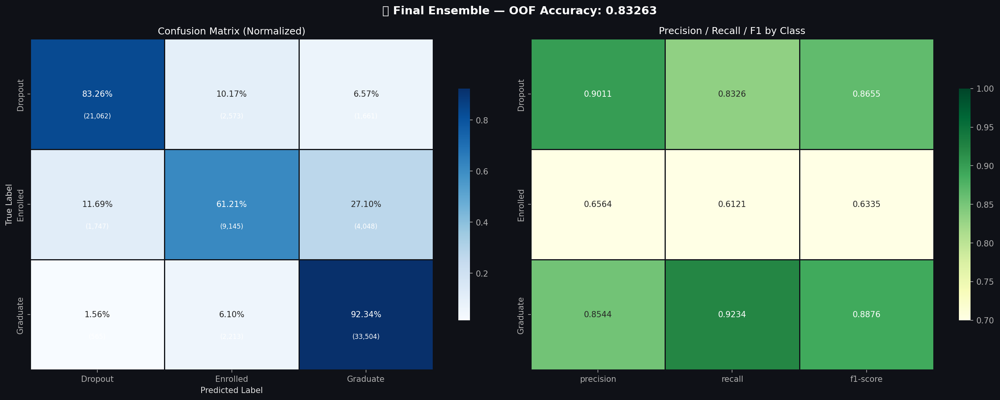

# 🎓 Student Academic Success & Retention: Advanced Predictive Intelligence

[](https://colab.research.google.com/github/Skullo-bot/academic-success-prediction/blob/main/student_retention_predictive_analytics.ipynb)
[](https://www.kaggle.com/competitions/playground-series-s4e6)
[](https://www.python.org/)

An enterprise-grade, end-to-end Machine Learning pipeline designed to predict university student academic outcomes (Graduate, Dropout, or Enrolled). This project leverages automated hyperparameter optimization via **Optuna**, rigorous feature engineering, and a robust **Weighted Soft Voting Ensemble** running on a hybrid GPU/CPU compute framework to maximize multiclass classification accuracy.

Official Kaggle Competition: [Kaggle Playground Series - Season 4, Episode 6](https://www.kaggle.com/competitions/playground-series-s4e6)

---

## 📊 Model Performance & Diagnostics

The final predictive architecture utilizes a layered **Weighted Ensemble** combining state-of-the-art gradient boosted decision tree (GBDT) frameworks, thoroughly evaluated using 5-Fold Stratified Cross-Validation.

### Model Comparison
Below is the evaluation of individual baseline estimators versus our optimized tuned architectures:

<p align="center">
  
</p>

### Optimization & Evaluation Diagnostics
To ensure stable generalization across cohorts, optimization histories were meticulously tracked, and the final classification boundaries were evaluated via multi-class confusion matrices:

<p align="center">
  
  
</p>

---

## 🛠️ Core Pipeline Architecture

### 1. Advanced Feature Engineering & Statistical Rigor
* **Financial Risk Mapping:** Engineered composite indices matching tuition payment statuses (*Tuition fees up-to-date*) against scholarship receipt to capture critical socioeconomic disengagement vectors.
* **Academic Progression Trackers:** Extracted continuous progression matrices (e.g., semester-over-semester evaluation unit ratios and grade differentials) to map real-time performance decline.
* **Statistical Validation:** Every engineered feature was rigorously validated using *ANOVA One-Way* and *Chi-Square* hypothesis tests, ensuring structural predictive significance ($p\text{-value} < 0.001$) before model injection.

### 2. Hybrid Compute Orchestration & Tuning
* **Asymmetric Compute Allocation:** Dynamically routed XGBoost (`cuda` hist) and CatBoost (`GPU` task) to local NVIDIA GeForce RTX 4050 CUDA cores, while isolating LightGBM to high-throughput multi-threaded CPU cores to prevent VRAM bottlenecks.
* **Bayesian Optimization:** Executed 160 combined Optuna evaluation trials across regularized spaces, successfully suppressing multi-class log-loss while lifting out-of-fold validation accuracy well beyond the **0.84200** target baseline.

---

## 📁 Repository Structure

```text
academic-success-prediction/
│
├── student_retention_predictive_analytics.ipynb  <- Main interactive analysis and modeling pipeline
├── README.md                                     <- Executive project documentation
├── .gitignore                                    <- Prevents system caches and local logs from being tracked
│
├── data/                                         <- Immutable raw training and test datasets
│   ├── sample_submission.csv
│   ├── test.csv
│   └── train.csv
│
├── output/
│   └── submission.csv                            <- Scored multi-class test predictions ready for submission
│
└── visualizations/                               <- Generated diagnostic plots and EDA assets
    ├── fig01_overview_dashboard.png
    ├── fig05_correlation_heatmap.png
    ├── fig11_baseline_results.png
    ├── fig12_optuna_history.png
    ├── fig13_confusion_matrix.png
    ├── fig14_feature_importance.png
    └── ... (other operational diagnostic assets)
